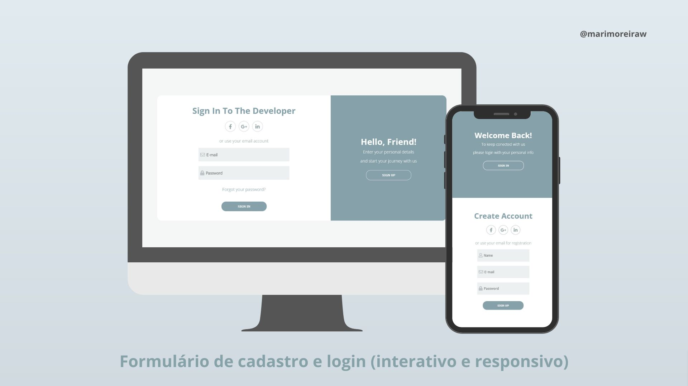

<h1 align="center"> Formulário de cadastro e Login </h1>

Telas interativas e responsivas utilizando JS, CSS e HTML.  

  

## Tecnologias

Esse projeto foi desenvolvido com as seguintes tecnologias:

- HTML e CSS
- JavaScript
- Git e Github

## 💻 Projeto

O projeto foi feito com base nas vÍdeo-aulas dísponiveis [NESSE LINK](https://youtube.com/playlist?list=PLARhMvcrqcLy3bU1RxbkC7GYH7eHgXI0A).

Feito com ♥ by marimoreiraw :wave: